# Database Documentation

## P1DatabaseContext

The P1DatabaseContext is an Entity Framework Core database context that inherits from IdentityDbContext with ApplicationUser. It manages the following entities and their relationships:

### Main Entities

- Rules: Base rules for the system
- Conditions: Conditions that can be applied to rules
- Results: Possible outcomes of rules
- Triggers: Events that can trigger rules
- DiscordUsers: Users from Discord
- UserMetaData: Additional user information
- UserItems: Items owned by users
- Items: Available items in the system
- Organizations: Group structures
- Games: Game-related data
- DiscordCommands: Available Discord bot commands
- DiscordCommandOptions: Options for Discord commands

### Key Relationships

1. Rules Relationships:
   - Rules to Conditions (Many-to-Many via ConditionRule)
   - Rules to Results (Many-to-Many via ResultRule)
   - Rules to Triggers (Many-to-Many via TriggerRule)

2. Team Relationships:
   - DiscordUser to Team (Many-to-Many via DiscordUserTeam)
   - Game to Team (Many-to-Many via GameTeam)
   - Team to Organization (Many-to-Many via TeamOrganization)
   - Organization to Legion (Many-to-Many via OrganizationLegion)

3. Item Relationships:
   - Items to Results (Many-to-Many via ItemResult)
   - Users to Items (Many-to-Many via UserItem)

### Features

- Automatic timestamp tracking (CreatedAt, UpdatedAt)
- User action tracking (CreatedBy, UpdatedBy)
- Cascade deletion for DiscordCommand options
- Custom context integration for user identification

### Dependencies

- Microsoft.AspNetCore.Identity.EntityFrameworkCore
- Microsoft.EntityFrameworkCore
- Custom ApplicationContext for user tracking
- IHttpContextAccessor for request context

```mermaid
erDiagram
    Rule {
        int Id
        string Name
        datetime CreatedAt
        string CreatedBy
        datetime UpdatedAt
        string UpdatedBy
    }
    Condition {
        int Id
        string Name
        datetime CreatedAt
        string CreatedBy
        datetime UpdatedAt
        string UpdatedBy
    }
    Result {
        int Id
        string Name
        datetime CreatedAt
        string CreatedBy
        datetime UpdatedAt
        string UpdatedBy
    }
    Trigger {
        int Id
        string Name
        datetime CreatedAt
        string CreatedBy
        datetime UpdatedAt
        string UpdatedBy
    }
    DiscordUser {
        int Id
        string UserName
        string Email
    }
    UserMetaData {
        int Id
        string Key
        string Value
    }
    UserItem {
        int UserId
        int ItemId
    }
    Item {
        int Id
        string Name
    }
    Organization {
        int Id
        string Name
    }
    Game {
        int Id
        string Name
    }
    ItemResult {
        int ItemId
        int ResultId
    }
    OrganizationUser {
        int OrganizationId
        int UserId
    }
    ResultRule {
        int ResultId
        int RuleId
    }
    DiscordCommand {
        int Id
        string Command
    }
    DiscordCommandOptions {
        int Id
        string Option
    }
    Rule ||--o{ ConditionRule : "has many"
    Condition ||--o{ ConditionRule : "has many"
    Rule ||--o{ ResultRule : "has many"
    Result ||--o{ ResultRule : "has many"
    Rule ||--o{ TriggerRule : "has many"
    Trigger ||--o{ TriggerRule : "has many"
    DiscordUser ||--o{ DiscordUserTeam : "has many"
    Team ||--o{ DiscordUserTeam : "has many"
    Game ||--o{ GameTeam : "has many"
    Team ||--o{ GameTeam : "has many"
    Organization ||--o{ TeamOrganization : "has many"
    Team ||--o{ TeamOrganization : "has many"
    Organization ||--o{ OrganizationLegion : "has many"
    Legion ||--o{ OrganizationLegion : "has many"
    Item ||--o{ ItemResult : "has many"
    Result ||--o{ ItemResult : "has many"
    User ||--o{ UserItem : "has many"
    Item ||--o{ UserItem : "has many"
    DiscordCommand ||--o{ DiscordCommandOptions : "has many"
```

