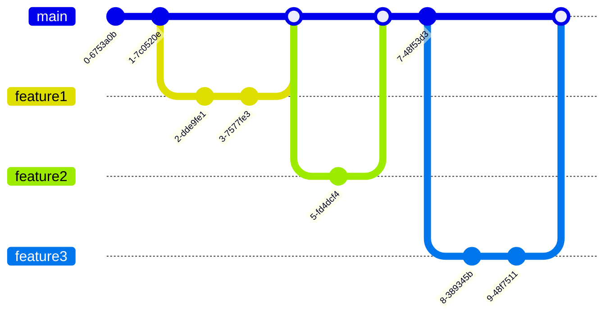

<!--TODO this needs to be cleaned up for readability -->

Here's a diagram showing trunk-based development along with an explanation:

Trunk-Based Development (TBD) is a branching strategy where developers collaborate on code in a single branch called 'trunk' (usually 'main' or 'master'). Key characteristics:

1. Short-lived feature branches
   - Developers create branches for new work
   - Branches typically last 1-2 days
   - Merged back to trunk frequently

2. Continuous Integration
   - All developers merge to trunk at least once per day
   - Automated tests run on every merge
   - Keeps integration problems small and manageable

3. Small commits
   - Changes are broken into small, manageable pieces
   - Makes code review easier
   - Reduces merge conflicts

4. Release branches (optional) - not currently used
   - Created only when needed for releases
   - No development happens on release branches
   - Only hotfixes applied to release branches

This approach supports continuous integration and delivery by keeping the mainline stable and reducing merge conflicts through frequent integration.

